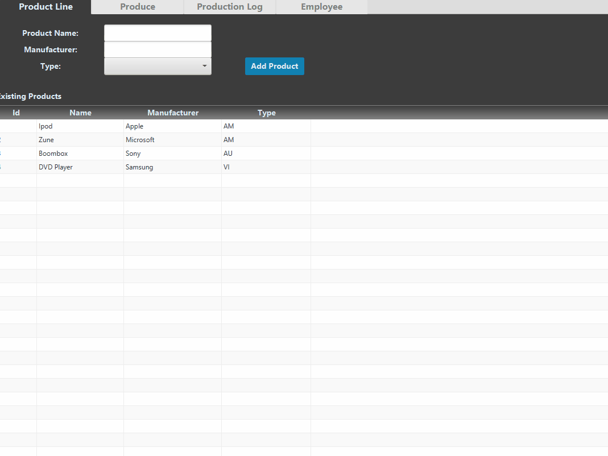
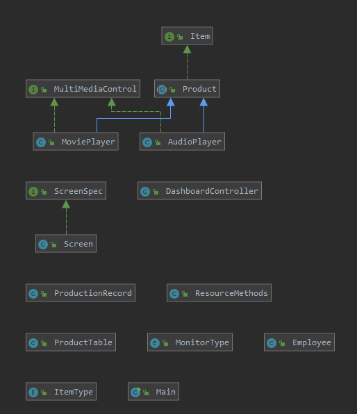

# Object Oriented Project

This project was made for my Object Oriented programing class. It demonstrates key concepts 
such as recursion, regular expressions, database integration, and GUI design. 

## Demonstration
 

## Documentation

[JavaDoc](https://rc9207.github.io/GUI_Program_OOP/)

## Diagrams

 

## Built With

* IntelliJ

## Author

* Seth T. Graham

